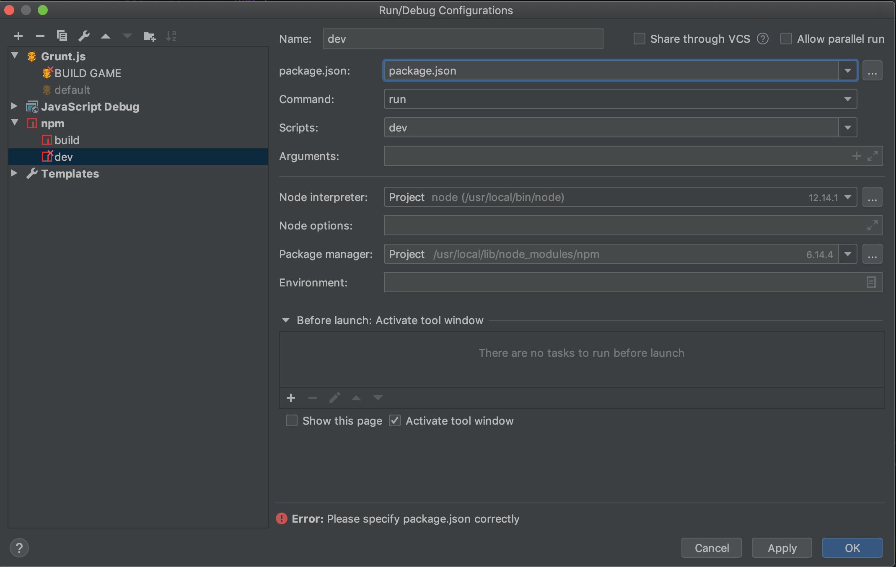
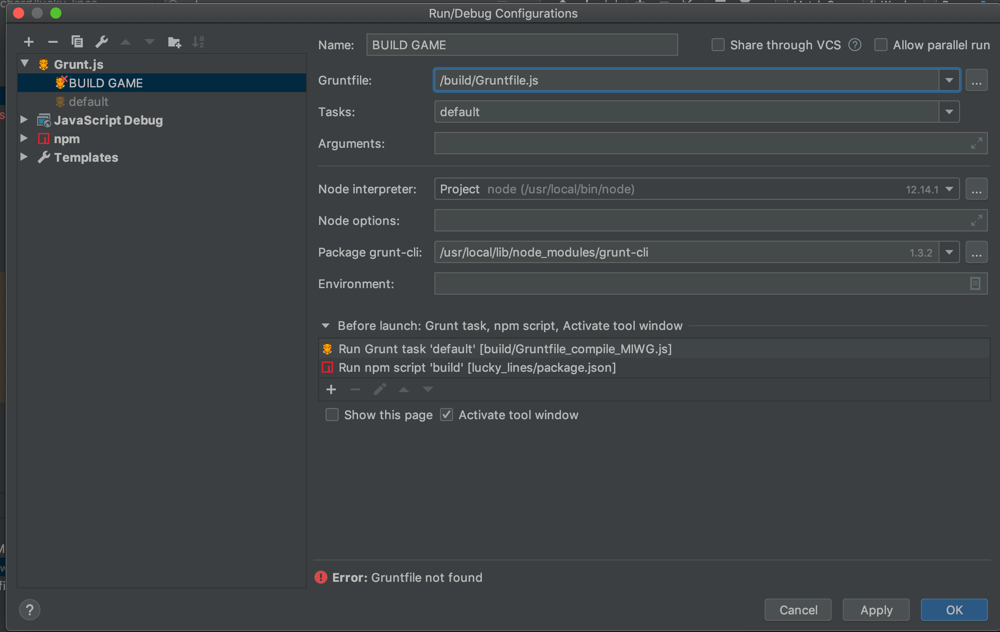
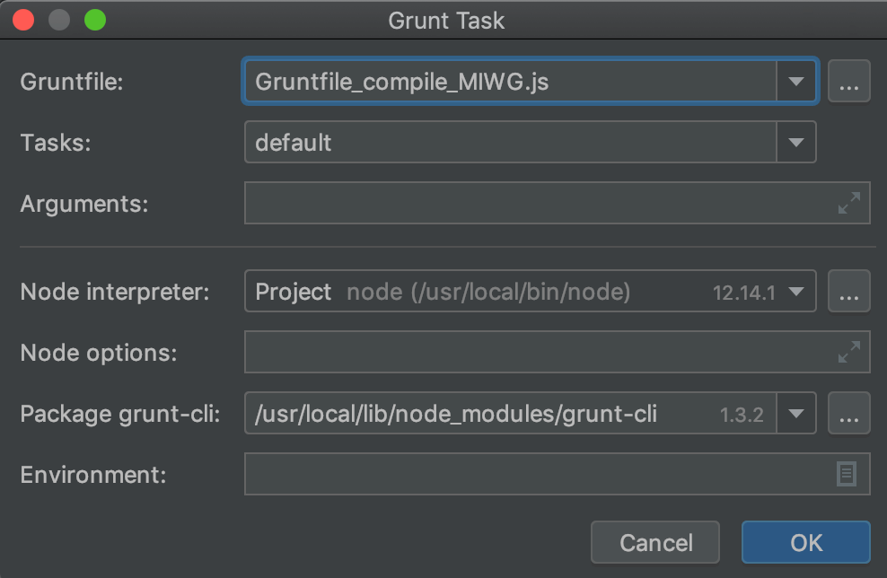
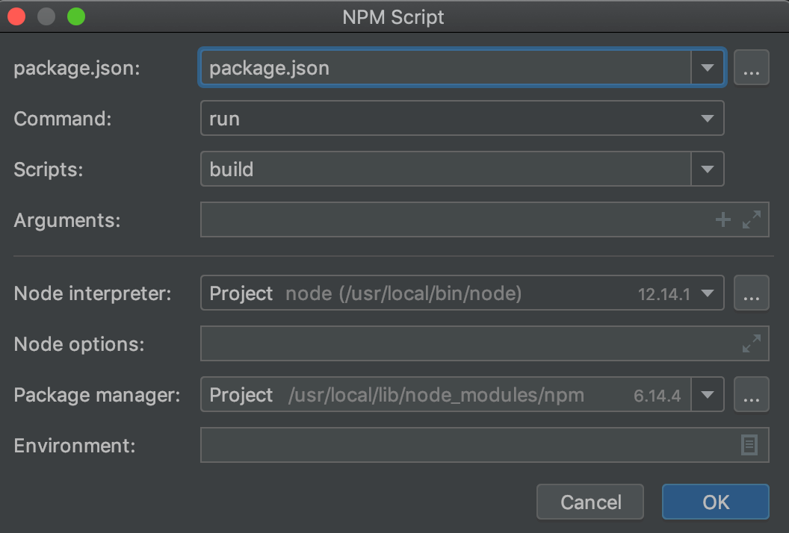

### **Don't push to this repository, it is meant to be used as a template only.**

# IWG game template

+ Go to settings -> options and check the "Template repository" box.
+ Create new repo using IWG_typescript_webpack_template from the template dropdown
+ Open in webstorm
+ In terminal run `npm install`
+ Edit IWG_SETUP with game name etc
+ Right click on Gruntfile_setup.js
+ Click on "Show Grunt File Tasks"
+ run default grunt task

Your IWG template should now be set up

#### To develop a game set up this npm task and run.
  

#### To build a game set up this Grunt task

  

It has 2 sub-tasks - set in the before launch window:

1. Gruntfile_compile_MIWG
  

2. npm webpack run build.

 

+ once this task has completed will have a timestamped zip in the bin folder - upload this to GTP

+ This template does not build a pixi renderer - it does however demo getting images from a sprite sheet into pixi.utils.textureCache.

+ The SpriteSheet and json file in the images folder were made using Texture Packer - I would recommend using this software as it is known to work.

